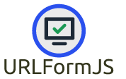

# UrlFormJS 



Sitcky URL Forms forms with sharable links.

## [Demo](https://cyphrme.github.io/URLFormJS/)

URLFormJS can be added directly into a project as a submodule with the following
command:

``` sh
git submodule add git@github.com:Cyphrme/URLFormJS.git
```

To update the submodule

When changes are made to URLFormJS, a project can update the changes by running
the following command from the directory where the project's .gitmodules lives:

```sh
git submodule update --remote
```


Alternatively, download `urlform.min.js` or clone the repo into the desired
project.

`urlform.js` is the human readable code, and can be used/called directly, but it
is recommended to use `urlform.min.js` (minified) when running production/live
code.


# Development
Issue submissions and pull requests are welcome.

To generate the minified file, you must first have `esbuild` installed on your
local machine, then run the following:
```sh
esbuild urlform.js --bundle --format=esm --minify --outfile=urlform.min.js
```

## Testing
To run the example/testing server, you must first have Go installed on your local
machine and run the following two commands:

```
cd /URLFormJS/BrowserTestJS/
go run server.go
```


Then go to `localhost:8082` and check the results.

Before submitting pull request, please run the tests to make sure that they are
all passing, and will not break current implementations.


## Probably out of scope for this library:
- Look into JSON Schema validation. 
- Form validation.  
- Field requirements/limitations. 

### Logo license
"you are free to use your logo for promotional purposes"
https://support.freelogodesign.org/hc/en-us/categories/360003253451-Copyrights

----------------------------------------------------------------------
# Attribution, Trademark notice, and License
URLFormJS is released under The 3-Clause BSD License. 

"Cyphr.me" is a trademark of Cypherpunk, LLC. The Cyphr.me logo is all rights
reserved Cypherpunk, LLC and may not be used without permission.